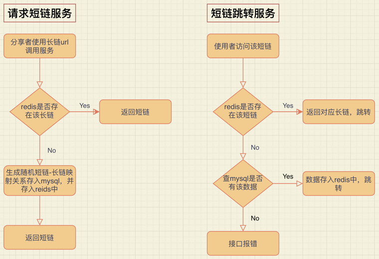

# solitude
Solitude is a project that converts long url into short url,  
supports short url jump to long url, and provides data caching and persistence.

[中文版README](README_cn.md)

## Project Structure
```
.
├── LICENSE
├── README.md
├── config
│   └── config.go
├── config.yaml
├── dao
│   ├── mysql.go
│   ├── redis.go
│   └── shorturl.go
├── go.mod
├── go.sum
├── handler
│   └── router.go
├── logic
│   └── shorten.go
└── main.go
```

## Config
```yaml
GIN_MODE: debug
Addr: 5555 # 端口号

MySQL:
  User: root
  Password: root
  Host: 127.0.0.1:3306
  DBname: test_data
Redis:
  Host: 127.0.0.1:6379
  Password:
  DB: 0  # use default DB
```

## Get Started
1.Enter the project directory and use the command `go run main.go` to start the project.

2.Set up short url. Visit this in the browser: `localhost:5555/shorten?url=https://news.cctv.com/2020/12/08/ARTItP6OrqV93zTT8kxMqKl2201208.shtml?spm=C94212.P4YnMod9m2uD.EfOoEZcMXuiv.9`
Get the following information like this: {"message":"eexrTL"}

3.Splicing url. Access the short link in the browser: `localhost:5555/expand/eexrTL`, and the result is a jump to the corresponding long link, DONE!

## Logic

